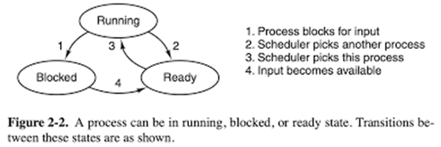

# Aula 1 - 18.02.2025:

Stream - só tem um fio de execução e pode ter vários clientes ao mesmo tempo
 (ex: node) - callbacks -> op. assíncronas
Servidor TCP/IP – Sockets:
 - Socket do lado do servidor
 - Socket do lado do cliente
 - Servidor fica á escuta de pedidos à espera de ligação.
 - Dois sockets: Um vai estabelecer a ligação bidirecional.
 - S: Ligação: ip:porto - socket fica binded
 - Para fazer accept é preciso fazer bind ao endereço
 - S: Accept fica á espera
 - C: Socket cliente permite fazer ligação
 - C: Accept vai retornar accept para a comunicação bidirecional.
serverSocket().accept() - representa a ligação com o cliente
fio de execução - forma de virtualizar um processador.

Echo Server - envia string e recebe de volta
- run() - equilvanete a loop
- 0.0.0.0 - socket fica binded para ligação de qualquer endereço
- Sockets interagem com API do SO.
use()  - garante que função faz o closeable automaticamente quando terminar.
quando não são precisso mais recursos do socket devo chamar a sua função close().

BufferedReader - Socket disponibiliza duas streams:
 getInputStream() e getOutputStream()
- Socket associado a estas duas streams.
InputStreamReader - transforma string de bytes em string de texto
Ao fechar ligação, o socket retorna NULL.

WSL ; wc [ip] [porto]

TaskManager Threads - número de threads para cada processo.
Fio de execução que se associa ao processador real. 
CPU virtual é desconectado e passa ao real.


## Estados de um Processo: RUN, BLOCKED, READY
 
Threads -> criar CPU virtual
nome da thread - thread.name
estado da thread - thread.state
se não tiver referencia para thread usar static: Thread.getCurrentThread().name

**Estados da thread:**
- NEW - thread ainda não iniciou
(executar .start() ...)
- RUNNABLE (sem código para executar, pronto a correr)
- BLOCKED 
- WAITING - espera que thread termine
- TERMINATED

A ordem de execução entre threads é completamente ARBRITARIA.
Thread termina sem esperar pela outra - visto depois em Sincronização de Threads.
Usar **thread.join()** - função bloqueante, thread só termina quando as outras terminarem. Ordem respeitada.

Criar várias threads:
```
val threads = listOf(Thread(..), Thread(..))
threads.foreach{ it.start() }
threads.foreach{ it.join() }
```

- Chamar instancia de .run() não está a criar uma instancia, 
deve-se usar .start() para criar uma nova instancia
