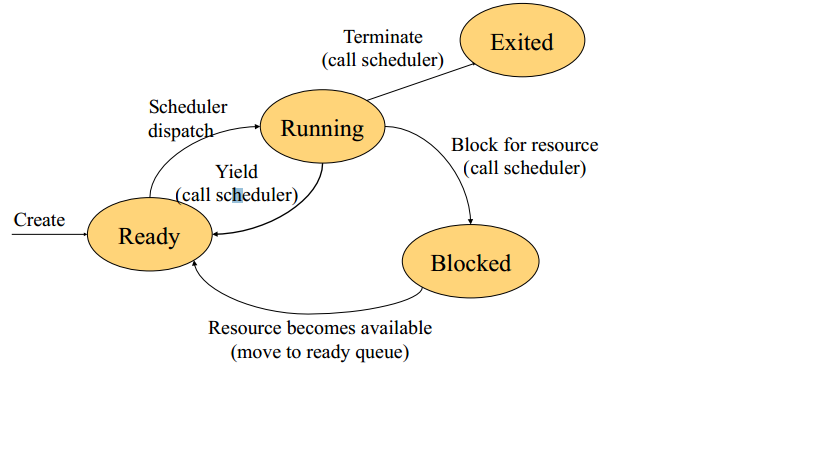
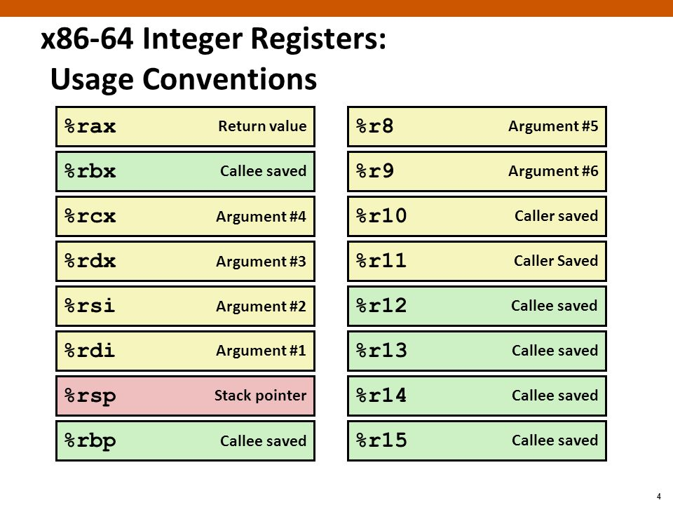
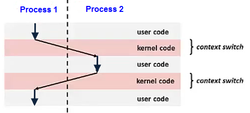

# Aula 3 - 26.02.2025 - *uthreads*

Estados Threads:
 - RUNNING
 - BLOCKING - vem para aqui através de op. bloqueante
 - READY - à espera que haja pedidos

 

 - Uma **Virtual Thread** pode estar associada a várias threads (1:N)
- Cada Thread tem um Stack

[img]

Registos:
- 16bit - d**x**
- 32bit - rd**i**
- 64bit - r10-r15
- Certeza que alguns registos são guardados: RBP; RDX, R13-R15. Ou seja, não é preciso guardar o valor destes ao chamar função.

- Contexto de switch: Thread a executar e a thread a que vou passar a execução:
    - T1 Thread_t
    - T2 Thread_t
    - context_switch(Thread_t *from, Thread_t *to)
    - Thread composta por pointers para: **CONTEXT** e **STACK**

- Guardar tudo o que é necessário para que no futuro recomece onde ficou:
    1) Guardar no stack da Thread
    2) Além dos registos é preciso guardar o Program counter
    3) Endereço da call de origem
    4) Guardar registos reservados (RBP ... R15)

## uthreads.c:
 - typedef struct para defenir stack: *thread_t*
 - typedef struct para representar contexto (começa pelo r15) : *context_t*
 - Função de *context switch* feita em assembly.
 - Stack pointer guardado em RDI.